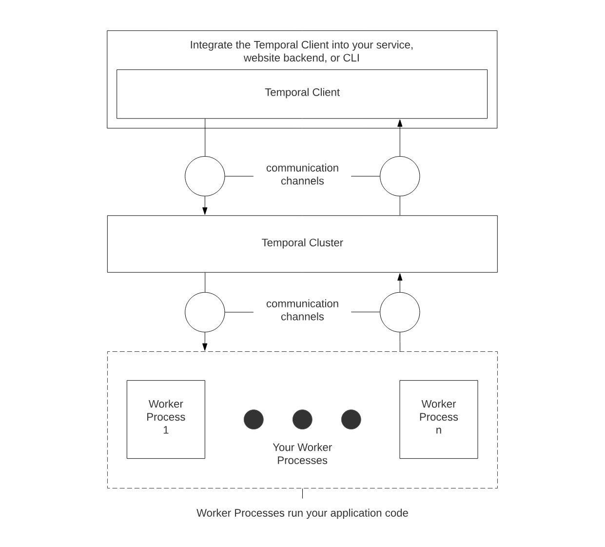
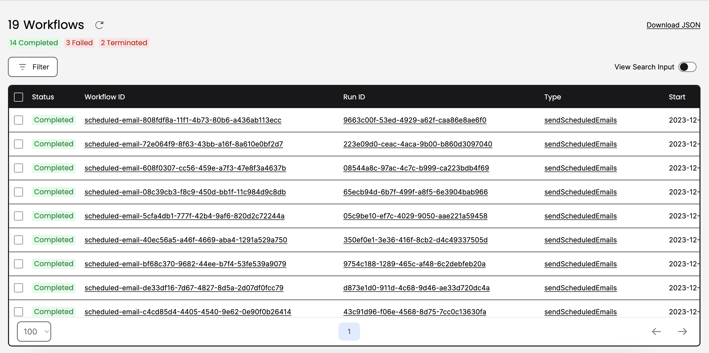

# Message Queue System Architecture

This document describes the architecture of a message queue system that solves the problem of inefficiency and failures when handling long running business processe or tasks that depends on downstream (or 3rd party) services, but need to be reliable and retry failed attempts.

I have chosen to use [Temporal](https://temporal.io/) as the backbone for this system.

Table Of Content

- [Message Queue System Architecture](#message-queue-system-architecture)
  - [What Is Temporal?](#what-is-temporal)
  - [Temporal vs Other Task Queue And Event Systems](#temporal-vs-other-task-queue-and-event-systems)
    - [Temporal vs HTTP-based Queues](#temporal-vs-http-based-queues)
  - [The Temporal Programming Model](#the-temporal-programming-model)
  - [Designing The Actual Message Queue System For Cal.com](#designing-the-actual-message-queue-system-for-calcom)
  - [Technical Requirements And Consideration](#technical-requirements-and-consideration)
    - [Scalability](#scalability)
    - [Reliability](#reliability)
    - [Monitoring and Logging](#monitoring-and-logging)
    - [Debugging](#debugging)
    - [Testing](#testing)
    - [Security](#security)

## What Is Temporal?

Temporal is a distributed, scalable, durable, and highly available task queuing and orchestration system. It guarantees the durable execution of your code. That is, it maintains the application state and progress even in the face of failures, crashes, or server outages. This is achieved through Temporal's use of an [Event History](https://docs.temporal.io/workflows#event-history), which records the state of a Workflow Execution at each step. If a failure occurs, the Workflow Execution can resume from the last recorded event, ensuring that progress isn't lost.

## Temporal vs Other Task Queue And Event Systems

There are other tools available for building event-driven applications, or implementing task queues for Node.js. There's is Kafka or RabbitMQ for implementing event streaming and message based systems. In Node.js, there are Redis-based task queues like [BullMQ](https://github.com/taskforcesh/bullmq) or [Bee Queue](https://www.npmjs.com/package/bee-queue).

They all solve a similar common problem, which is to put task within a queue and define a worker/consumer that acts on the events or tasks. Temporal does solve the same problems as these task queue libraries (or message queue software). But, Temporal's feature set provides several advantages over conventional task queues. It is;

1. Durable: This means that your application can withstand any failure. The system keeps tracks of the workflow/application state, and automatically resumes from the last failure point.
2. Reliable: The system is robust enough to handle timeouts and retry automatically.
3. Cancellable: You can cancel workflows (tasks) via the UI or dynamically based on a business logic.
4. Developer friendly: You can monitor or debug task from the UI. There are primitives to efficiently write unit and integration tests. You can also do time-travel debugging and [replay](https://docs.temporal.io/dev-guide/typescript/testing#replay) a particular workflow execution. The TypeScript SDK gives us the advantage of type safety.

While it's possible to implement your own solution to achieve some of those features, they require knowing some advanced integration patterns and are very hard problems to solve and scale. Temporal is built on more 15 years of experience of those who have built similar complex systems in AWS, Microsoft and Uber.

### Temporal vs HTTP-based Queues

There are HTTP-based queues like [QStash](https://upstash.com/blog/qstash-announcement) which is simpler to integrate into serverless applications. This is a good solution if all you need is just calling some APIs and being able to retry those API calls in the case of a failure. However, they're also very limitting in terms of what they offer. Using QStash as an example, here are some of the limitations:

- The retry mechanism is limited to you specifying just the number of attempts.
- It's hard to ensure atomic transaction/processing. When the API/function called by Qstash fails half-way through, QStash will retry calling it at a designated, and the function will start processing from the beginning, most likely leading to errors or duplicate data/transaction in your system. However, the solution I'm proposing (using Temporal), you can build a Workflow such that your code can re-start right at the point it was before the failure.

Those are just a few example of the limit to trade-off when you choose something like QStash. The sections below highlights the my solution to give Cal.com a robust task queue system.

## The Temporal Programming Model

Temporal gives us an edge to solve a variety of problems with a simple programming model. It defines itself as an orchestration platform, for the durable execution of your code, which defined as Workflows.

The perspective is that your business model/processes can all be modelled as workflows, giving you the ability to co-ordinate with fine detail how they should be executed. Below are some specific terms used within Temporal.

- Workflow 📖: The high-level business logic of your program. Essentially, this is where the logic of your application begins. All Workflow logic must be deterministic. (Technically, execution starts with the Worker, and the Worker runs the Workflow code.)
- Activity 💾: Components of your Workflow that might fail, e.g. sending email. Workflow code orchestrates the execution of Activities
- Worker 👷: The process that’s actually doing the work executing all of your Temporal code (the Workflow and Activities). Capitalized here to denote the Temporal-specific concept of a Worker, to differentiate from the generic idea of a worker process.

You can learn more about those (and more) in the Temporal [documentation](https://docs.temporal.io/concepts/).

## Designing The Actual Message Queue System For Cal.com

There are 3 main components involved in the design of this message queue system.

1. Temporal Cluster/Server: Manages the execution of your application code (Workflow).
2. Worker: A Worker Process is responsible for polling a [Task Queue](https://docs.temporal.io/workers#task-queue), dequeueing a [Task](https://docs.temporal.io/workers#task), executing your code in response to a Task, and responding to the Temporal Cluster with the results.
3. Cal.com Temporal Client/Application: These are applications (e.g the Next.js web app or public API) that trigger a Workflow Execution, which the Worker Process picks up.

Those three components are needed to make the message queue system function. However, we need to define Activity and Workflow that should be processed by the Worker.

Conceptually, a workflow defines a sequence of steps. Those steps are defined by writing code, known as a Workflow Definition, and are carried out by running that code, which results in a Workflow Execution.

An Activity could be something like sending an email (e.g. `sendEmail()`). A Workflow could be defined for the series of steps needed to complete a transaction. For example, sending scheduled email when an event is scheduled or cancelled, or processing a particular webhook. The workflows and activities can be maintained in the respective *packages/* folder where they're needed.  

There's a `apps/queue-worker` project that contains the Worker Process code and related tests. We import all the packages containing the Workflow definition and use them to set up the Worker.

Each Cal.com application that needs to execute a Workflow installs the `@temporalio/client` package, import the Workflow packages, and use those info to start the Workflow using the Temporal SDK.

> The associated PR contains proof of concept for workflows to send emails, and a Worker that executes a Workflow when a new meeting event is scheduled.

## Technical Requirements And Consideration

### Scalability

The Temporal Platform is a scalable system. You can self-host it on your own Kubernetes Cluster or use Temporal Cloud. If we self-host, here's an introduction [document](https://temporal.io/blog/scaling-temporal-the-basics) to Scaling the Temporal Cluster.

The Worker Process can be scaled horizontally or vertically as a typical Node.js application.

### Reliability

Temporal is a durable and reliable system. Any failed task is automatically retried until infinity. You don't have to implement retry logic by yourself. You can configure the [retry policy](https://docs.temporal.io/dev-guide/typescript/features#activity-retries) using the SDK.

### Monitoring and Logging

Temporal provides an extensive Observability features for the Temporal Cluster. You can view the state of your application via metrics, tracing, and logging. They provide integration and guides using the OpenTelemtry collector, which means you can export those data to your own monitoring server (e.g Axiom or Datadog). Find out more in the Temporal Observability [guide](https://docs.temporal.io/dev-guide/typescript/observability).

For the Worker, you can use Sentry to collect data just like you would for any Node.js application. The current Worker implementation integrates with Sentry. You can try it out by adding your Sentry DSN to the `.env` file.

You can also use OpenTelemetry in the Worker project and export Tracing data to Axiom or any observability provider that supports OpenTelemetry. The [interceptors-opentelemetry](https://github.com/temporalio/samples-typescript/tree/main/interceptors-opentelemetry) official sample shows how to use the SDK's built-in OpenTelemetry tracing to trace everything from starting a Workflow to Workflow Execution to running an Activity from that Workflow.

> I didn't include a sample integration for Otel & Axiom because of the time constraint.

### Debugging

You can use the Temporal Web UI to visualise Wokrflow Execution -- you can see the input/payload, the current step in the execution, and any failing Activity with the error message.

You can even [replay a Workflow Execution](https://docs.temporal.io/dev-guide/typescript/testing#replay) (i.e. time-travel debugging), to recreate the exact state of a Workflow Execution.

### Testing

Temporal also provides support for testing the application. It's the first system I've used that gives me this nice integration and testing capability. I can write unit and integration tests for my application using popular frameworks like Mocha or Jest.

In the implemented message queue project (i.e. `apps/queue-work`), I included test for the email-workflow Workflow. You can run it using `yarn run test`. For more information on testing with Temporal, check the [docs](https://docs.temporal.io/dev-guide/typescript/testing).

### Security

Temporal Offer extensive security information whether you're self-hosting or using the SaaS version.

For information about the security features of our SaaS offering, Temporal Cloud, see their [Cloud security page](https://docs.temporal.io/cloud/security).

For information about how to self-host a secure Temporal Platform, see the [Self-hosted security page](https://docs.temporal.io/self-hosted-guide/security).

There's also a means to pass a custom data transformer that can transform the data sent and received by the Temporal Server.
